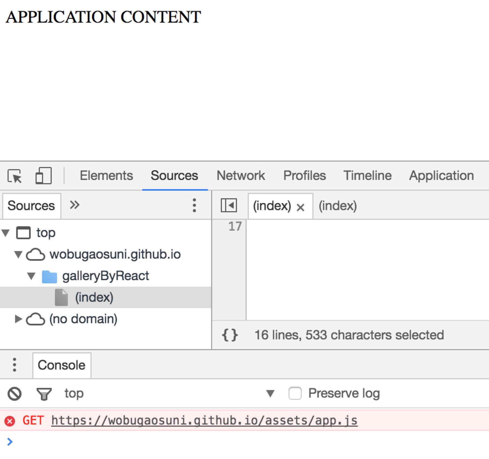
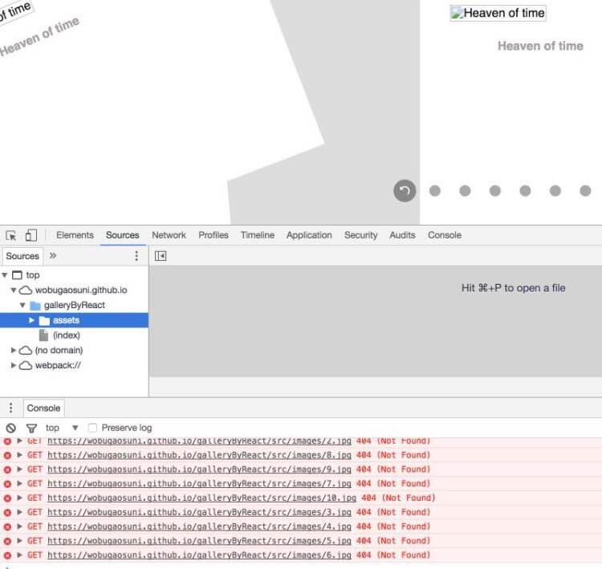

## 项目概览
链接：https://wobugaosuni.github.io/galleryByReact/ <br />

基本需求：
- 刷新网页，每张图片随机排布，而且图片在-30度~30度之间随机旋转
- 点击位于中心的图片，翻转
- 点击除了中心外的图片，与中心图片互换位置
- 圆点导航栏：
  - 位于中心的图片所在的导航点，高亮显示。点击该圆点，图片翻转
  - 位于四周的图片所在的导航点，被点击时，与中心图片互换位置


## 项目简介
- 使用`YEOMAN`搭建项目，生成项目文件、代码结构
- 使用`webpack`实现前端自动化
- 使用`HTML5`新增标签，如`<section>、<figure>、<figcaption>、<nav>`等
- 使用`lessc`编译器将less文件编译成css文件，并使用`wr`工具，实现chrome调试样式并映射到本地文件保存
- 使用`react+ES6`框架完成画廊页面制作
- 使用`CSS3`的transition属性，实现旋转、平移、背景色的逐渐过渡
- 使用`iconfont`字体文件代替图片文件，支持CSS3对字体的修饰效果
- 使用`json`格式存放图片信息


## 在本地打开项目
```bash
# 在终端执行以下命令安装环境依赖(下载慢的情况下，可以使用淘宝镜像：cnpm；或者直接在终端使用代理翻墙)
  npm install

# 安装成功后执行以下命令，即可在浏览器中打开
  npm start

# dist文件的编译，执行
  npm run dist
```


## Get到的小技巧
屏幕渲染机制有两种：
- 灰阶渲染：控制边缘亮度，所耗内存相对较低，应用于手机
- 亚像素渲染：效果更好，所耗内存相对更高，应用于Mac等

Mac上有些浅色字体图片（在上面设置了白色，可以设置为深色进行测试）在浏览器上显得较粗  <br />

解决方案：在父元素上设置属性，修改浏览器的属性：  <br />

```css
-webkit-font-smoothing: antialiased; /* 开启chrome在Mac下字体渲染的灰阶平滑 */  <br />
-moz-osx-font-smoothing: grayscale; /* 开启firefox在Mac下字体渲染的灰阶平滑 */
```


## 遇到的困难和解决方法
### 1. 翻转函数和样式的实现
  - 解决方法: 规划好整个组件的排版布局，如下。通过类名控制翻转

  ```html
  <section> -- relative
    <section> -- relative
      <figure> -- absolute
        
        <figcaption>
          <h2>(图片正面描述)</h2>
          <div>(图片背面描述)</div> -- absolute
        </figcaption>
      </figure>
    </section>
    <nav> -- absolute
      （导航点组件)
    </nav>
  </section>
  ```
  由于实现图片翻转有两种方式：点击图片自身 + 点击导航点 <br />
  因此翻转函数写在父组件为宜，直接return一个闭包函数

### 2. 把项目发布到gh-pages分支
  - 路径错误

    <div align=center></div>

    原因：<br />
    在本地编译时，由于运行时是在根目录，可以写绝对路径 <br />
    但在生成的网页中，项目处于二级目录下，需要将编译后的绝对地址改为相对地址 <br />

    1. 将绝对路径改为相对路径
    ```bash
    #default.js:
    `publicPath: '/assets/',` 改成：`publicPath: 'gallaryByReact/assets/',`

    #index.html:
    `<script type="text/javascript" src="/assets/app.js"></script>`
    改成：`<script type="text/javascript" src="assets/app.js"></script>`
    ```

    2. 在终端重新编译dist，执行：`npm run dist`

    3. 把修改的dist提交到gh-pages分支 <br />
    `git add dist` <br />
    `git commit -m "change path from absolute to relative"` <br />
    `git subtree push --prefix=dist origin gh-pages`

    <br />
  - 图片没有编译到dist目录

    <div align=center></div>

    原因：<br />
    npm run dist时，没有把images目录包含进去 <br />
    ` "copy": "copyfiles -f ./src/index.html ./src/favicon.ico ./dist"` <br />

    解决方法：增加images目录到dist，如下 <br />
    ` "copy": "copyfiles -f ./src/index.html ./src/favicon.ico ./dist && cp -a ./src/images ./dist/"`
